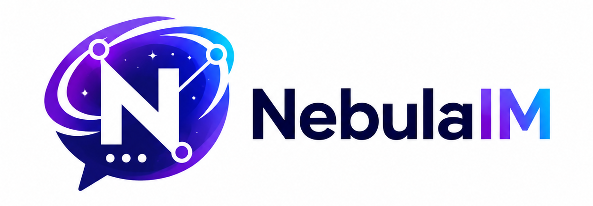

# NebulaIM Web

<p align="center">
  
</p>

NebulaIM Web is the React web client for NebulaIM. It talks to the C++ Gateway with the NebulaIM binary Packet + Protobuf protocol, and uses the Web Bridge for browser-safe HTTP APIs and the public WebSocket entrypoint.

## Current Architecture

```text
Browser
  -> HTTP
  -> NebulaIM Web Bridge :8080
  -> gRPC
UserService / RelationService / ConversationService / AdminService

Browser
  -> WebSocket /ws on NebulaIM Web Bridge :8080
  -> transparent TCP proxy
  -> NebulaIM Gateway 127.0.0.1:9000
  -> NebulaIM PacketHeader + Protobuf body
MessageService / PushService / UserService
```

The browser never sends JSON to Gateway. Gateway traffic remains NebulaIM binary frames. The public browser endpoint is the Bridge `/ws` route, because the production Gateway listens on loopback.

## Runtime Endpoints

Production endpoint values are deployment-specific. Use placeholders in documentation and keep real hostnames or IP addresses in environment variables, GitHub Actions secrets or server-side configuration.

```text
Bridge HTTP:       http://<public-host>:8080
Gateway WebSocket: ws://<public-host>:8080/ws
Gateway TCP label: tcp://<public-host>:9000
```

When the built app is served by the Bridge itself, the frontend uses same-origin endpoints:

```text
Bridge HTTP:       window.location.origin
Gateway WebSocket: ws(s)://window.location.host/ws
```

Persisted browser settings are migrated away from the old `localhost:9000` and `localhost:8080` defaults by settings version `8`.

## Tech Stack

- React
- TypeScript
- Vite
- Tailwind CSS
- Zustand
- React Router
- Axios
- Lucide React Icons
- Recharts
- Framer Motion
- protobufjs

## Pages

- `/` product entry page
- `/login` Gateway `LOGIN_REQ` over Bridge `/ws`
- `/register` Gateway `REGISTER_REQ` over Bridge `/ws`
- `/app/chat` conversation list, direct chat, group chat, Gateway heartbeat, ACK state and PUSH messages
- `/app/contacts` RelationService friends plus incoming and outgoing friend requests
- `/app/groups` RelationService groups
- `/app/profile` current user and Gateway metadata
- `/app/settings` Gateway WebSocket and Bridge HTTP endpoint controls
- `/dashboard` Bridge health and AdminService live metrics
- `/admin` AdminService console

## Features

- Gateway binary transport over WebSocket through Bridge `/ws`.
- Browser-side PacketHeader encoder/decoder in `src/services/browserPacketCodec.ts`.
- Browser-side Protobuf loading in `src/services/browserProtoRegistry.ts`.
- Gateway client implementation in `src/services/directGatewayClient.ts`.
- Bridge HTTP API layer for UserService, RelationService, ConversationService and AdminService.
- Relation workflow based on friend requests: send, list incoming/outgoing, accept and reject.
- Conversation and message state backed by Gateway pushes and ConversationService HTTP APIs.
- Zustand stores split by domain.
- Local persistence for auth token and settings.
- Token expiry tracking and refresh through UserService.
- HTTP request IDs and trace IDs.
- HTTP retry and message retry actions.
- Dashboard metrics loaded from AdminService.
- Admin console for health, system stats, outbox stats, Kafka lag and cleanup.

## Directory Structure

```text
nebulaim-web/
├── bridge/
│   ├── package.json
│   ├── src/
│   │   ├── index.ts
│   │   ├── config.ts
│   │   └── server/
│   │       ├── httpServer.ts
│   │       ├── authRoutes.ts
│   │       ├── relationRoutes.ts
│   │       ├── conversationRoutes.ts
│   │       └── adminRoutes.ts
├── proto/
├── public/
│   ├── logo.png
│   ├── favicon.svg
│   └── proto/
└── src/
    ├── api/
    ├── components/
    ├── pages/
    ├── routes/
    ├── services/
    ├── store/
    ├── types/
    └── utils/
```

## Install

```bash
npm install
cd bridge && npm install
```

## Development

Start the NebulaIM backend and dependencies first. Then start the Bridge:

```bash
cd bridge
cp .env.example .env
npm run dev
```

Start Vite in another shell:

```bash
npm run dev
```

Open:

```text
http://localhost:5173
```

Local development defaults still point at the production host unless overridden by env vars:

```bash
VITE_GATEWAY_WS_URL=ws://localhost:8080/ws VITE_BRIDGE_HTTP_URL=http://localhost:8080 npm run dev
```

Use those overrides when your local Bridge can reach a local Gateway.

## Build

```bash
npm run build
cd bridge && npm run build
```

## Preview

```bash
npm run preview
```

## Backend Ports

```text
Gateway TCP/WebSocket: 9000
Gateway RPC: 50055
UserService: 50051
MessageService: 50052
RelationService: 50053
PushService: 50054
ConversationService: 50056
AdminService: 50057
Prometheus: 9090
Grafana: 3000
```

Gateway `:9000` is a backend-side address. Browser clients should use the Bridge WebSocket route unless Gateway is intentionally exposed.

## Gateway Protocol

The frontend Gateway client opens a WebSocket to `/ws` on the Bridge. The Bridge forwards the WebSocket upgrade and all binary frames to the configured Gateway TCP address.

```text
WebSocket Binary Payload = NebulaIM PacketCodec bytes
```

Packet header:

```text
uint32 magic       0x4E494D42
uint16 version     1
uint16 type
uint32 sequence_id
uint32 body_length
```

Important message types:

```text
REGISTER_REQ=1003
REGISTER_RESP=1004
LOGIN_REQ=1001
LOGIN_RESP=1002
HEARTBEAT_REQ=1101
HEARTBEAT_RESP=1102
SEND_SINGLE_MSG_REQ=2001
SEND_SINGLE_MSG_RESP=2002
SEND_GROUP_MSG_REQ=2101
SEND_GROUP_MSG_RESP=2102
PUSH_MSG=3001
ACK_REQ=4001
ACK_RESP=4002
PULL_OFFLINE_MSG_REQ=5001
PULL_OFFLINE_MSG_RESP=5002
ERROR_RESP=9001
```

All packet bodies are Protobuf encoded. Proto files are synchronized from `~/NebulaIM/proto` into `proto/` and `public/proto/`.

## Bridge HTTP API

The Bridge exposes HTTP endpoints for backend gRPC services:

```text
GET  /health
GET  /info
WS   /ws

POST /api/auth/refresh
GET  /api/auth/users/:userId
GET  /api/auth/users/by-username/:username

GET  /api/relation/friends?userId=<id>
GET  /api/relation/friend-requests?userId=<id>&incoming=true&status=0
POST /api/relation/friend-requests
POST /api/relation/friend-requests/:requestId/accept
POST /api/relation/friend-requests/:requestId/reject
DELETE /api/relation/friends/:friendId?userId=<id>
POST /api/relation/groups
POST /api/relation/groups/:groupId/join
POST /api/relation/groups/:groupId/leave
GET  /api/relation/groups/:groupId/members

GET    /api/conversations?userId=<id>&page=1&pageSize=50
POST   /api/conversations/:conversationId/read
DELETE /api/conversations/:conversationId
POST   /api/conversations/:conversationId/pin
POST   /api/conversations/:conversationId/mute

GET  /api/admin/health
GET  /api/admin/system-stats
GET  /api/admin/outbox-stats
GET  /api/admin/kafka-lag
POST /api/admin/cleanup
```

`GET /info` includes the configured backend service addresses and `websocket: "/ws"`.

Friend requests use these payloads:

```json
{
  "fromUserId": "10001",
  "toUserId": "10002",
  "message": "hello"
}
```

```json
{
  "userId": "10002"
}
```

The action payload is used for both accept and reject.

Admin requests send the raw AdminService token as:

```text
X-Nebula-Admin-Token: <token>
```

The Bridge forwards it to AdminService as gRPC metadata key `x-nebula-admin-token`.

## End-to-End Integration

1. Start NebulaIM dependencies:

```bash
cd ~/NebulaIM
./scripts/start_deps.sh
./scripts/init_topics.sh
```

2. Start backend services:

```bash
./scripts/start_services.sh
```

Or start services separately:

```bash
./build/user_service/nebula_user_service --config config/nebula.conf
./build/message_service/nebula_message_service --config config/nebula.conf
./build/push_service/nebula_push_service --config config/nebula.conf
./build/relation_service/nebula_relation_service --config config/nebula.conf
./build/conversation_service/nebula_conversation_service --config config/nebula.conf
./build/admin_service/nebula_admin_service --config config/nebula.conf
./build/gateway/nebula_gateway --config config/nebula.conf
```

3. Start Web Bridge:

```bash
cd nebulaim-web/bridge
npm install
cp .env.example .env
npm run dev
```

4. Start Web frontend:

```bash
cd nebulaim-web
npm install
npm run dev
```

5. Open:

```text
http://localhost:5173
```

6. Verify the live flow:

- Register two users.
- Login both users in separate browser contexts.
- From user A, send user B a friend request by username or numeric backend `user_id`.
- From user B, accept the incoming friend request.
- Confirm both users list each other as friends.
- Open Chat and select the friend from the centered friend list.
- Send a message.
- Confirm sender status reaches `delivered`.
- Confirm recipient receives `PUSH_MSG`.
- Check ConversationService via `/api/conversations`.
- Open `/admin`, enter an AdminService token from the backend config, then check health/outbox/kafka/cleanup.

## Admin Tokens

Admin tokens are owned by the backend config under `admin_service.admin_tokens`. The frontend stores only the value typed into the Admin page and sends it as `X-Nebula-Admin-Token`.

Use scoped, non-development tokens before exposing the system.

## Docker Compose

```bash
docker compose -f docker-compose.web.yml up --build
```

The compose file runs Vite on `5173` and the Bridge on `8080`. The web container uses `ws://localhost:8080/ws` and `http://localhost:8080` from the browser, while the Bridge container reaches backend services through `host.docker.internal`.

## GitHub Actions Deployment

The workflow in `.github/workflows/deploy.yml` builds the frontend and Bridge, uploads a release archive over SSH and restarts the Bridge systemd service.

Required GitHub Actions secrets:

```text
DEPLOY_HOST      SSH host or IP address
DEPLOY_SSH_KEY   Private key with deploy access
```

Optional secrets or variables:

```text
DEPLOY_USER      SSH user, defaults to root
DEPLOY_PORT      SSH port, defaults to 22
DEPLOY_PATH      Server deploy path, defaults to /opt/nebulaim-web
DEPLOY_SERVICE   systemd unit name, defaults to nebulaim-web-bridge.service
```

The workflow does not overwrite an existing server-side `bridge.env`. If `bridge.env` is missing, it initializes one from `deploy/production.env.example`.

The deploy user must be `root` or have passwordless `sudo` for writing the deploy path and restarting systemd. The server must also have Node.js and npm available for installing Bridge production dependencies.

## Verification

```bash
npm run lint
npm run build
cd bridge && npm run lint
cd bridge && npm run build
```

For a running production-style Bridge:

```bash
curl -s http://127.0.0.1:8080/health
curl -s http://127.0.0.1:8080/info
```

## Common Issues

- Browser login fails: verify `GET /info` returns `websocket: "/ws"` and the browser settings use `ws://<host>:8080/ws`.
- Bridge `/ws` returns `502`: verify Gateway is listening at `GATEWAY_TCP_HOST:GATEWAY_TCP_PORT`.
- Gateway closes the socket: verify the frontend is sending binary WebSocket frames, not JSON/text frames.
- Friend request accept fails: the accepting request body must contain the receiver's numeric `userId`.
- Message send fails: verify `/info` includes the MessageService target and `/api/messages/single` can reach it.
- Message does not reach MessageService: confirm `MESSAGE_SERVICE_HOST:MESSAGE_SERVICE_PORT` points to the running backend service.
- Conversation list is empty: send a message first or verify `ConversationService :50056`.
- Admin health works but cleanup fails: the token likely lacks `cleanup` scope.
- Admin Kafka lag returns permission denied: use a token with `kafka` scope.
